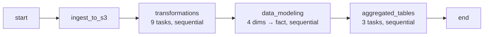
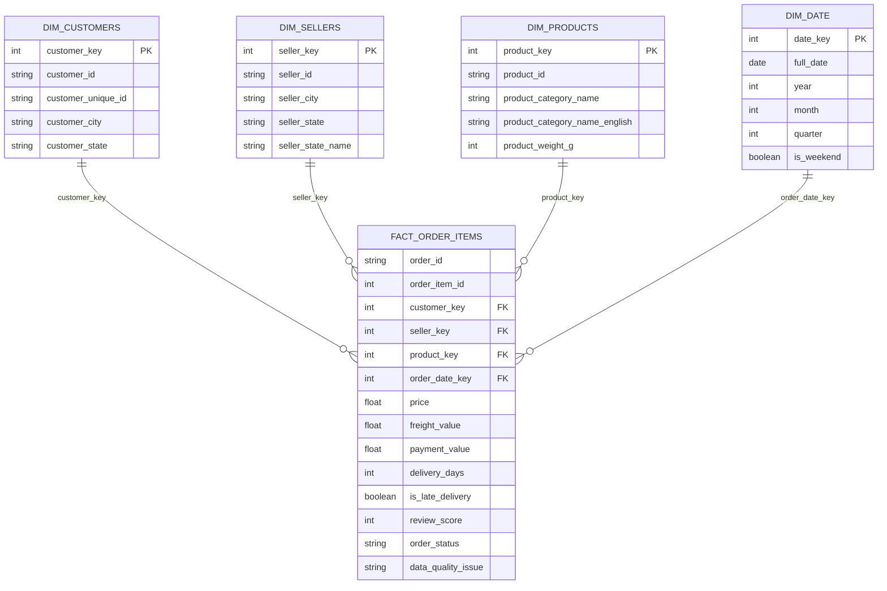

# Automated Cloud Batch Pipeline

A containerized, Airflow-orchestrated batch ETL pipeline that transforms the [Olist Brazilian e-commerce dataset](https://www.kaggle.com/datasets/olistbr/brazilian-ecommerce) into an analytics-ready star schema on AWS S3, using a bronze → silver → gold medallion architecture built with Python, PySpark, boto3, and Apache Airflow.

## 🎯 About This Project

As a Computer Science student specializing in Data Science, I built this project to strengthen my hands-on skills in:
- PySpark & Distributed Data Processing
- Cloud Data Storage & Integration (AWS S3)
- ETL Pipeline Design (Bronze → Silver → Gold Medallion Architecture)
- Data Modeling (Star Schema — dimensions, fact tables, aggregates)
- Data Cleansing & Quality Assurance (validation guardrails, fan-out-safe joins)
- Pipeline Automation & Orchestration (Apache Airflow, Docker containerization)

It's designed to reflect the kind of foundational data engineering work found in real analytics teams — automating the ingestion, cleaning, and modeling of raw e-commerce data into an analytics-ready warehouse — and serves as a portfolio piece demonstrating my understanding of end-to-end, cloud-based data pipeline design.

## 🏗️ Architecture

The entire pipeline runs as a single Airflow DAG (`ecommerce_pipeline`) inside a Dockerized Airflow cluster (CeleryExecutor + Postgres + Redis). Execution is deliberately serialized (`max_active_tasks=1`) so every task — ingestion, each silver transform, each dimension, the fact table, each aggregate — runs one at a time, in a fixed, predictable order.

```
Local CSVs
    │  boto3 upload (no transform)
    ▼
Bronze  (raw copies)          s3://bucket/bronze/<dataset>/
    │  PySpark: clean, standardize, enforce data quality
    ▼
Silver  (cleaned tables)      s3://bucket/silver/<dataset>/
    │  PySpark: join, dedupe, generate surrogate keys
    ▼
Gold    (star schema)         s3://bucket/gold/<table>/
    ├── dim_customers
    ├── dim_sellers
    ├── dim_products
    ├── dim_date
    └── fact_order_items
    │  PySpark: roll up the star schema
    ▼
Aggregated reporting tables   s3://bucket/gold/<agg_table>/
    ├── agg_category_peformance
    ├── agg_seller_performance
    └── monthly_sales_by_state
```

Each layer writes back to S3 as a single, cleanly-named CSV (see [`config.py`](#configpy) for how the Spark multi-part output problem is handled), so every script in the next layer has a predictable path to read from.

```mermaid
graph TD
    A[Local machine<br/>Raw_data/*.csv] -->|boto3 upload| B[S3 bronze/<br/>raw CSVs, untouched]
    B -->|PySpark| C[S3 silver/<br/>cleaned, DQ-checked]
    C -->|PySpark| D[S3 gold/<br/>star schema]
    D -->|PySpark| F[S3 gold/<br/>aggregated reporting tables]
    D --> E[write_layer_csv&#40;&#41;<br/>temp write to locate part file to copy to clean key to cleanup]
```





## 📂 Project structure

```
.
├── docker/
│   ├── Dockerfile              # apache/airflow base + OpenJDK 17 + PySpark/boto3
│   ├── docker-compose.yml      # Airflow cluster: webserver, scheduler, worker, triggerer, postgres, redis
│   ├── dags/
│   │   └── ecommerce_pipeline.py   # the Airflow DAG tying every stage together
│   ├── logs/                   # Airflow task logs (mounted volume)
│   ├── plugins/                # Airflow plugins (mounted volume)
│   └── config/                 # Airflow config overrides (mounted volume)
├── scripts/
│   ├── config.py                # shared config, Spark session, S3 helpers
│   ├── ingestion/
│   │   └── ingest_to_s3.py       # bronze: raw CSV upload via boto3
│   ├── transformations/          # bronze → silver
│   │   ├── category_translation.py
│   │   ├── customers.py
│   │   ├── geolocation.py
│   │   ├── items.py
│   │   ├── orders.py
│   │   ├── payments.py
│   │   ├── products.py
│   │   ├── reviews.py
│   │   └── sellers.py
│   ├── data_modeling/            # silver → gold (star schema)
│   │   ├── dim_customers.py
│   │   ├── dim_date.py
│   │   ├── dim_products.py
│   │   ├── dim_sellers.py
│   │   └── fact_order_items.py
│   └── aggregated_tables/        # gold → reporting rollups
│       ├── agg_category_peformance.py
│       ├── agg_seller_performance.py
│       └── monthly_sales_by_state.py
├── Raw_data/                   # local source CSVs (gitignored)
└── .env                        # AWS credentials (gitignored)
```

## Orchestration (Airflow)

The DAG (`docker/dags/ecommerce_pipeline.py`) is manually triggered (`schedule=None`, `catchup=False`) and runs four stages in strict sequence:

| Stage | Task group | What it does |
|---|---|---|
| 1 | `ingest_to_s3` | Uploads every raw CSV from `Raw_data/` to `bronze/` in S3 |
| 2 | `transformations` | Runs all 9 bronze → silver scripts, one after another |
| 3 | `data_modeling` | Builds the 4 dimensions, then `fact_order_items` last (it depends on all dims) |
| 4 | `aggregated_tables` | Builds the 3 reporting rollups on top of the finished star schema |

`max_active_tasks=1` is set intentionally at the DAG level — nothing runs in parallel anywhere in the pipeline, which keeps runs predictable and easy to debug when a step fails.

## Data model (gold layer)

**Fact table:** `fact_order_items` — grain: one row per order line item.

| Column | Description |
|---|---|
| `order_id`, `order_item_id` | natural keys |
| `customer_key`, `seller_key`, `product_key` | surrogate keys → dimensions |
| `order_date_key` | surrogate key → `dim_date` (yyyyMMdd) |
| `price`, `freight_value`, `payment_value` | measures |
| `delivery_days`, `is_late_delivery` | derived delivery metrics |
| `review_score` | first review per order |
| `data_quality_issue` | inherited quality flag |

**Dimensions:** `dim_customers`, `dim_sellers`, `dim_products` (joined with category translation), `dim_date` (generated calendar, 2016-09-01 to 2018-12-31).

**Aggregated reporting tables** (built on top of the star schema): `agg_category_peformance`, `agg_seller_performance`, `monthly_sales_by_state`.



## Data quality strategy

Two tiers of enforcement in the silver layer:

- **Hard fail** — the job raises an exception and stops the DAG run if it finds data that shouldn't exist: negative prices/freight/payments, review scores outside 1–5.
- **Soft flag** — a `data_quality_issue` column marks rows with real-world but usable gaps (missing delivery timestamps, missing product weight) so downstream consumers can decide how to handle them, without blocking the pipeline. This flag is carried all the way through to `fact_order_items`.

## Setup

**Requirements:** Docker & Docker Compose, an AWS account with S3 access.

Create a `.env` file next to `docker-compose.yml`:

```
AIRFLOW_UID=50000
AWS_ACCESS_KEY_ID=your_access_key
AWS_SECRET_ACCESS_KEY=your_secret_key
AWS_DEFAULT_REGION=your_aws_region
```

Update `BUCKET_NAME` and `AWS_REGION` in `scripts/config.py` to point at your own S3 bucket.

Place the raw Olist CSVs in `Raw_data/`.

## Running the pipeline

Everything runs inside Docker — no local Python/Spark install needed.

```bash
cd docker

# 1. Initialize the Airflow metadata DB and admin user (one-time / on upgrade)
docker compose up airflow-init

# 2. Start the full cluster (webserver, scheduler, worker, triggerer, postgres, redis)
docker compose up -d

# 3. Open the Airflow UI
#    http://localhost:8080   (default login: airflow / airflow)

# 4. Trigger the DAG
#    In the UI, find "ecommerce_pipeline" and click the ▶ Trigger button.
#    It will run ingestion → transformations → data_modeling → aggregated_tables
#    in order, with each task waiting for the previous one to finish.
```

Optional: enable the Flower Celery monitoring UI on port `5555`:

```bash
docker compose --profile flower up -d
```

## Tech stack

- **Apache Airflow** (2.11.0, CeleryExecutor) — orchestrates the entire pipeline as a single DAG
- **PySpark** (3.5.6) — distributed transforms for the silver and gold layers
- **boto3** (1.40.11) — S3 upload and part-file cleanup
- **hadoop-aws** (3.3.4) — S3A connector for Spark-to-S3 I/O
- **Docker / Docker Compose** — containerizes the whole Airflow cluster for reproducible deployment
- **PostgreSQL** — Airflow metadata database
- **Redis** — Celery message broker
- **python-dotenv** — local credential management

## Notes

- `config.py` centralizes the S3 write logic: Spark's `.write.csv()` always produces a folder (part-file + `_SUCCESS` + `.crc`), so `write_layer_csv()` writes to a temp prefix, locates the single part file via boto3, copies it to a clean final key, and deletes the temp folder.
- Payments and reviews are pre-aggregated to one row per `order_id` before joining into the fact table, to avoid join fan-out.
- `order_items`, `payments`, and `reviews` all land under `silver/orders/` (not their own top-level folders) by convention, since they're all order-grain tables consumed together by `fact_order_items`.
- The pipeline is fully serialized on purpose (`max_active_tasks=1`) — there's no parallelism anywhere in the DAG, trading some runtime for simplicity and easy debugging.

---

## 👤 About Me

Hi I'm Guhan, a Data Science student. This project is part of my ongoing effort to build practical, portfolio-ready experience in data engineering and analytics.

---

## 🛡️ License

This project is licensed under the MIT License. Feel free to explore, learn from, and build on it.
