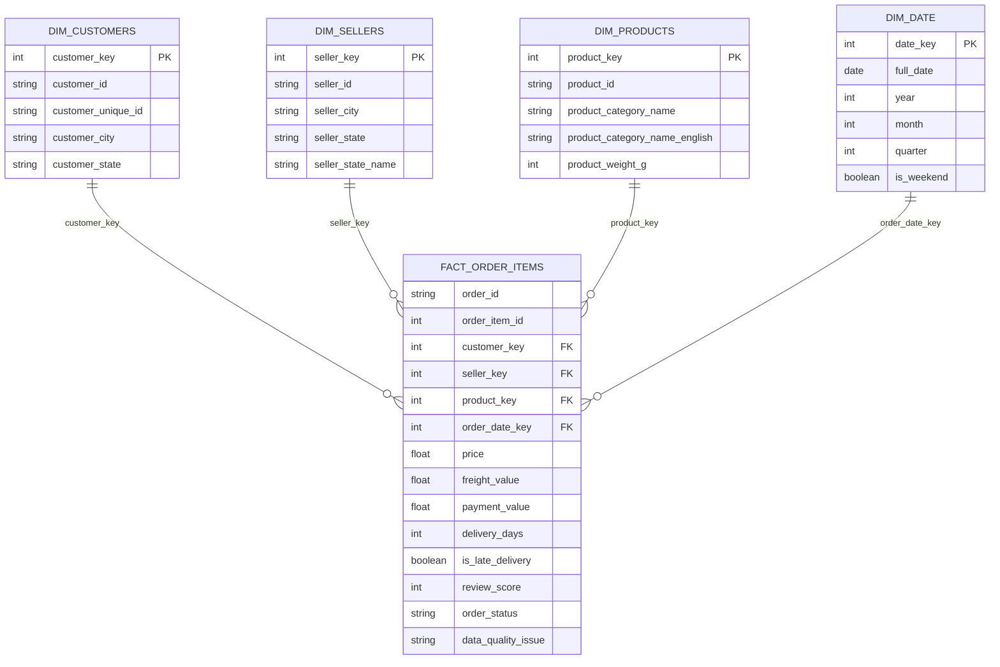

# Automates Cloud Batch Pipeline

A batch ETL pipeline that transforms the [Olist Brazilian e-commerce dataset](https://www.kaggle.com/datasets/olistbr/brazilian-ecommerce) into an analytics-ready star schema on AWS S3, using a bronze → silver → gold medallion architecture built with Python, boto3, and PySpark.
## 🎯 About This Project

As a Computer Science student specializing in Data Science, I built this project to strengthen my hands-on skills in:
- PySpark & Distributed Data Processing
- Cloud Data Storage & Integration (AWS S3)
- ETL Pipeline Design (Bronze → Silver → Gold Medallion Architecture)
- Data Modeling (Star Schema — dimensions, fact tables, aggregates)
- Data Cleansing & Quality Assurance (validation guardrails, fan-out-safe joins)
- Pipeline Automation (Airflow orchestration, Docker containerization)

It's designed to reflect the kind of foundational data engineering work found in real analytics teams — automating the ingestion, cleaning, and modeling of raw e-commerce data into an analytics-ready warehouse — and serves as a portfolio piece demonstrating my understanding of end-to-end, cloud-based data pipeline design.

##🏗️ Architecture

```
Local CSVs
    │  boto3 upload (no transform)
    ▼
Bronze  (raw copies)          s3://bucket/bronze/<dataset>/
    │  PySpark: clean, standardize, enforce data quality
    ▼
Silver  (cleaned tables)      s3://bucket/silver/<dataset>/
    │  PySpark: join, dedupe, generate surrogate keys
    ▼
Gold    (star schema)         s3://bucket/gold/<table>/
    ├── dim_customers
    ├── dim_sellers
    ├── dim_products
    ├── dim_date
    └── fact_order_items
```

Each layer writes back to S3 as a single, cleanly-named CSV (see [`config.py`](#configpy) for how the Spark multi-part output problem is handled), so every script in the next layer has a predictable path to read from.

```mermaid
graph TD
    A[Local machine<br/>Raw_data/*.csv] -->|boto3 upload| B[S3 bronze/<br/>raw CSVs, untouched]
    B -->|PySpark| C[S3 silver/<br/>cleaned, DQ-checked]
    C -->|PySpark| D[S3 gold/<br/>star schema]
    D --> E[write_layer_csv&#40;&#41;<br/>temp write to locate part file to copy to clean key to cleanup]
```



##📂 Project structure

```
.
├── config.py                  # shared config, Spark session, S3 helpers
├── ingest_to_s3.py            # bronze: raw CSV upload via boto3
├── silver/
│   ├── category_translation.py
│   ├── customers.py
│   ├── geolocation.py
│   ├── items.py
│   ├── orders.py
│   ├── payments.py
│   ├── products.py
│   ├── reviews.py
│   └── sellers.py
├── gold/
│   ├── dim_customers.py
│   ├── dim_date.py
│   ├── dim_products.py
│   ├── dim_sellers.py
│   └── fact_order_items.py
├── Raw_data/                  # local source CSVs (gitignored)
└── .env                       # AWS credentials (gitignored)
```

## Data model (gold layer)

**Fact table:** `fact_order_items` — grain: one row per order line item.

| Column | Description |
|---|---|
| `order_id`, `order_item_id` | natural keys |
| `customer_key`, `seller_key`, `product_key` | surrogate keys → dimensions |
| `order_date_key` | surrogate key → `dim_date` (yyyyMMdd) |
| `price`, `freight_value`, `payment_value` | measures |
| `delivery_days`, `is_late_delivery` | derived delivery metrics |
| `review_score` | first review per order |
| `data_quality_issue` | inherited quality flag |

**Dimensions:** `dim_customers`, `dim_sellers`, `dim_products` (joined with category translation), `dim_date` (generated calendar, 2016-09-01 to 2018-12-31).



## Data quality strategy

Two tiers of enforcement in the silver layer:

- **Hard fail** — the job raises an exception and stops if it finds data that shouldn't exist: negative prices/freight/payments, review scores outside 1–5.
- **Soft flag** — a `data_quality_issue` column marks rows with real-world but usable gaps (missing delivery timestamps, missing product weight) so downstream consumers can decide how to handle them, without blocking the pipeline.

## Setup

**Requirements:** Python 3.9+, Java 8/11 (for Spark), an AWS account with S3 access.

```bash
pip install pyspark boto3 python-dotenv
```

Create a `.env` file in the project root:

```
AWS_ACCESS_KEY_ID=your_access_key
AWS_SECRET_ACCESS_KEY=your_secret_key
```

Update `BUCKET_NAME` and `AWS_REGION` in `config.py` to point at your own S3 bucket.

Place the raw Olist CSVs in `Raw_data/`.

## Running the pipeline

Scripts run in dependency order — each layer depends on the previous one already being in S3.

```bash
# 1. Bronze: upload raw CSVs
python ingest_to_s3.py

# 2. Silver: clean and standardize
python silver/category_translation.py
python silver/customers.py
python silver/geolocation.py
python silver/items.py
python silver/orders.py
python silver/payments.py
python silver/products.py
python silver/reviews.py
python silver/sellers.py

# 3. Gold: build dimensions, then the fact table
python gold/dim_customers.py
python gold/dim_sellers.py
python gold/dim_products.py
python gold/dim_date.py
python gold/fact_order_items.py   # must run last -- depends on all dims
```

## Tech stack

- **PySpark** — distributed transforms for the silver and gold layers
- **boto3** — S3 upload and part-file cleanup
- **hadoop-aws** — S3A connector for Spark-to-S3 I/O
- **python-dotenv** — local credential management

## Notes

- `config.py` centralizes the S3 write logic: Spark's `.write.csv()` always produces a folder (part-file + `_SUCCESS` + `.crc`), so `write_layer_csv()` writes to a temp prefix, locates the single part file via boto3, copies it to a clean final key, and deletes the temp folder.
- Payments and reviews are pre-aggregated to one row per `order_id` before joining into the fact table, to avoid join fan-out.

---

## 👤 About Me

Hi I'm Guhan, a Data Science student . This project is part of my ongoing effort to build practical, portfolio-ready experience in data engineering and analytics.

---

## 🛡️ License

This project is licensed under the MIT License. Feel free to explore, learn from, and build on it.
